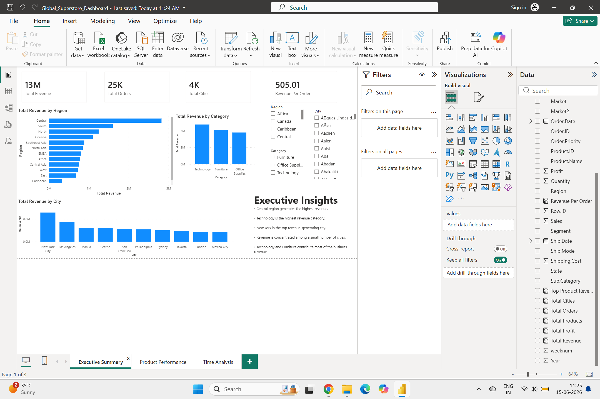
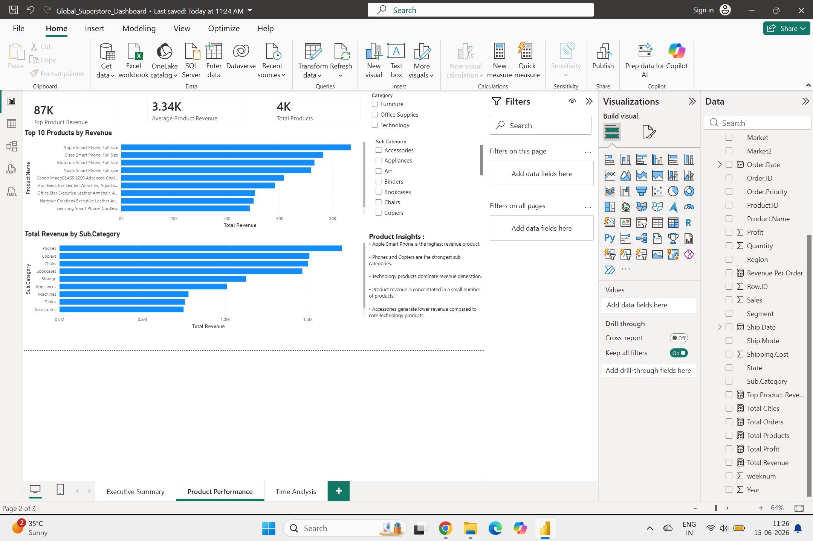
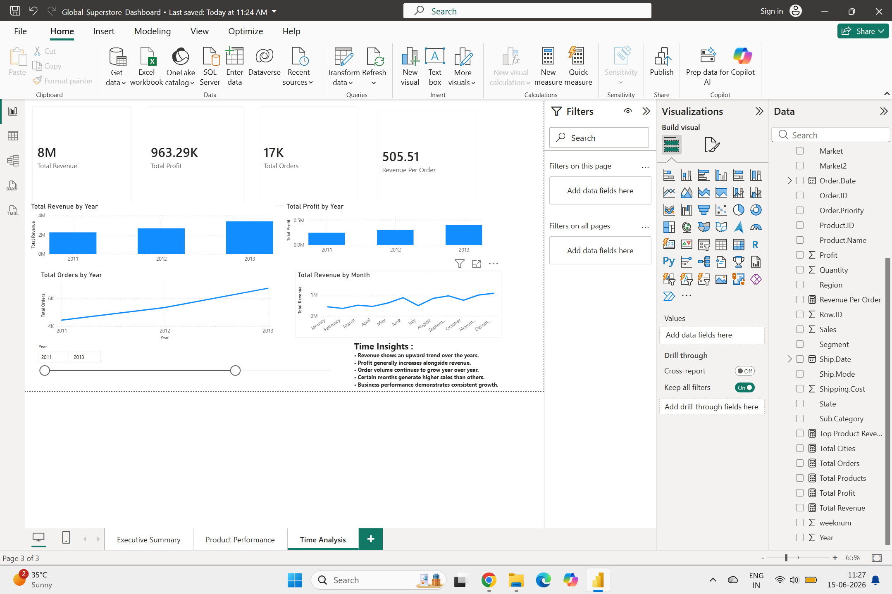

# Global Superstore Power BI Dashboard

## Project Overview

This Power BI dashboard analyzes sales performance, product performance, and business growth trends using the Global Superstore dataset.

## Tools Used

- Power BI
- DAX
- Data Modeling
- Data Visualization

---

## Dashboard Pages

### 1. Executive Summary
- Total Revenue
- Total Orders
- Revenue by Region
- Revenue by Category
- Top Revenue Cities
- Interactive Slicers

### 2. Product Performance
- Top Revenue Products
- Revenue by Sub-Category
- Product Analysis
- Product Insights

### 3. Time Analysis
- Revenue Trend
- Profit Trend
- Order Trend
- Monthly Revenue Analysis
- Time Insights

---

## Key Insights

- Central region generated the highest revenue.
- Technology is the highest revenue category.
- Apple Smart Phone generated the highest product revenue.
- Revenue and profit increased consistently over time.
- Order volume showed steady year-over-year growth.

---

## Dashboard Screenshots

### Executive Summary

---

### Product Performance

---

### Time Analysis

---

## Files Included

- Global_Superstore_Dashboard.pbix
- Executive_Summary.png
- Product_Performance.png
- Time_Analysis.png
